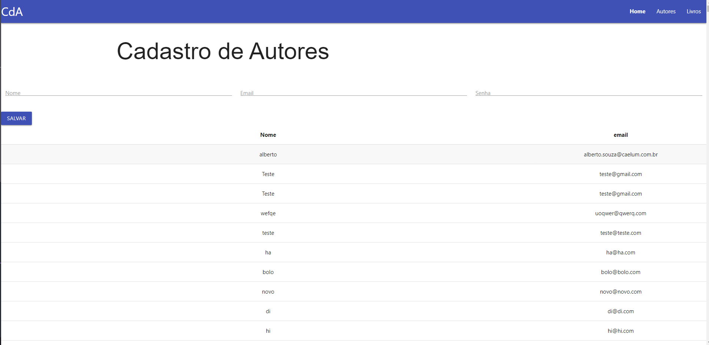

# Authors registration

This Project was developed for learning purposes only.
It comes from one of the React courses from [Alura](https://www.alura.com.br/).

## Built With

- ReactJS
- CSS3
- Materialize.css
- FetchAPI [api provided by alura](http://cdc-react.herokuapp.com/api/)

  
  

## Learn More about React

You can learn more in the [Create React App documentation](https://facebook.github.io/create-react-app/docs/getting-started).

To learn React, check out the [React documentation](https://reactjs.org/).

